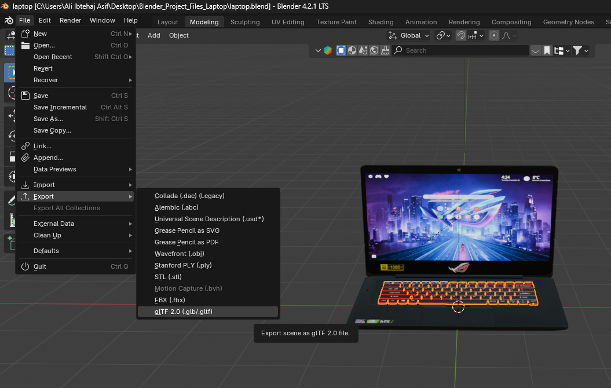
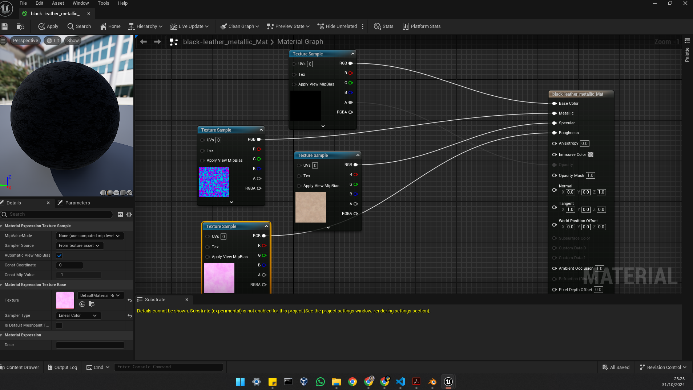
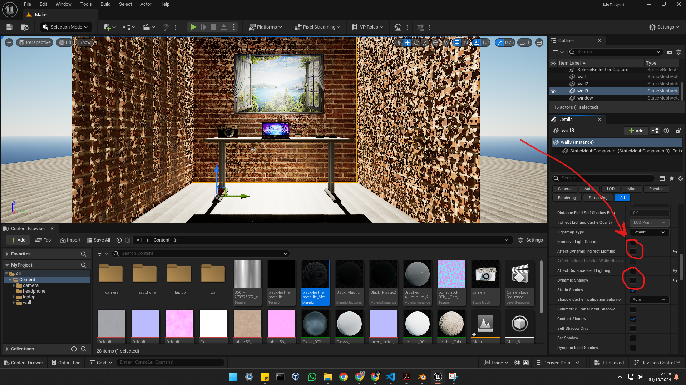
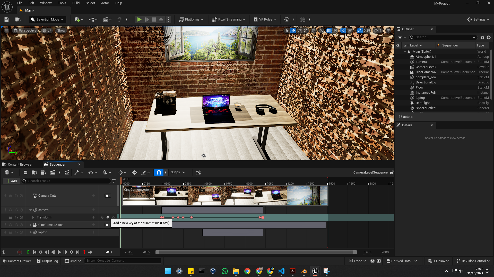

# How the objects were imported to Unreal
In blender I selected the gltf 2.0 option to export my object. I chose .gltf instead of the common .fbx option because for object .gltf is much better at keeping the materials and textures intact. For .fbx I was getting too much problem. Then In unreal engine 5, I created a new project and in the content browser I created a new folder for each object for example a folder named "laptop" when I just dragged and droped the .gltf file for the laptop I exported from blender.

# Pipeline fixes and issues sorted
## First Issue: Material and Textures for my camera
Even though I used .gltf but still it is not perfect. For the camera I made it didn't import the texture for the black leather correctly. So to fix it I duplicated the white leather texture and edited it by double clicking it which took me to the Material Graph. The .gltf import did import the pattern and roughness as an pink color image file for the original black leather. So in the Material graph I dragged and dropped both of these files and connected their texture sample RGB pin to the metallic and roughness pin of the main block (which i renamed to black leather). Then for the base color I changed it to black and kept the specular same. And finally I created the black texture myself with the bits and pieces available. Luckily I didn't had to do this often. For the headphones and the table the texture was imported as an image file just not applied so I just dragged and dropped it onto the object to fix it. Same for the walls and window.

## Second Issue: Light
As I mentioned in the blender render part that I added rectangular light to give the effect of light coming out of the window. Here I did 2 things. I added the rectangular to light to give the same effect but it was just not as good so I basicaly moved the Sun behind the window and made the window to pass the light through by removing the "Dynamic indirect lighting" and "Dynamic Shadow" options

# How I created my animation
To create my animation I used both moving objects + moving camera and used the sequncer to make the animation.

So basically I added a camera to the scene and in the sequencer I added it as an "Actor to Sequencer" along with my retro-camera object and laptop object because I only wanted to move those two. Then I used the "add new key at current time" button moved the camera and objects as desired and then again "add new key at current time". This saved the sequence I from one point to another and I made my animation.