# Modelling process
# 1. Camera
## Reference
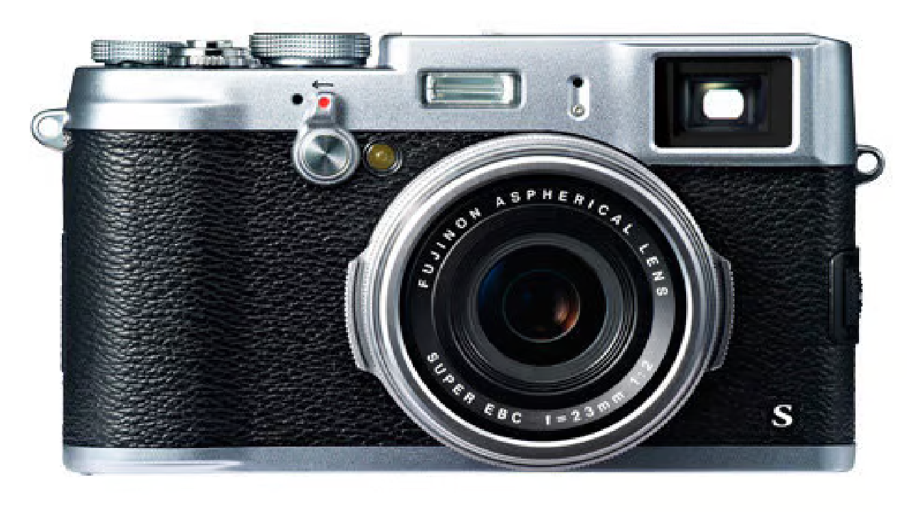
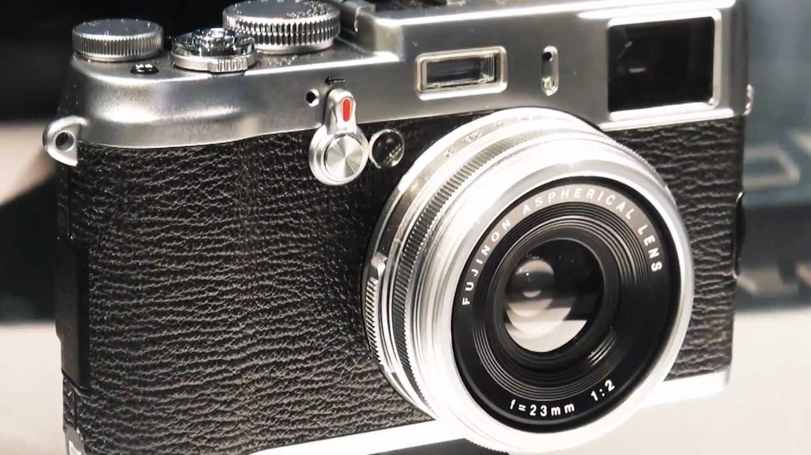
## Modelling Steps
- I selected a cube and adjust dimensions (3.8, 1.2, 2.1)
- Then in edit Mode (Tab) I added a loop cut (Ctrl R) and adjust position to be slighty to the left from the center (double G)

- On the top and right face, I extrude face (E) to form the higher part of the camera where the lens would be in the front
- Then I set the bevel modifier with amount 0.013 and segment 10 to make the base cube of camera smooth.
- For the sharp edges I select them in edit mode (Tab) and use (Ctrl+B) to bevel or curve them.
- For the top knobs I added a cylinder and scale to a thin size
- Then I used the Extrude (E) make it taller and then select the face in edit mode and press (S) to stretch it out and then again E to extrude and then (I) to Inset the face and then extrude again. This gave the basic shape. 
- Then for the middle part I go to edit mode (Tab) and select one rectangular face (cylinder is made of many rectangle) and then Alt+select to select the whole curve of the cylinder and then press to seperate it by selection.
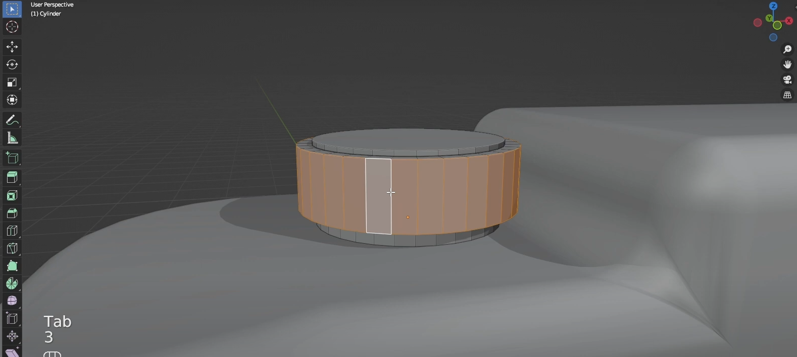
- Then I right click this new selection and subdivide it to 4 cuts.
- Then I again right click, select poke faces and go to vertex select mode
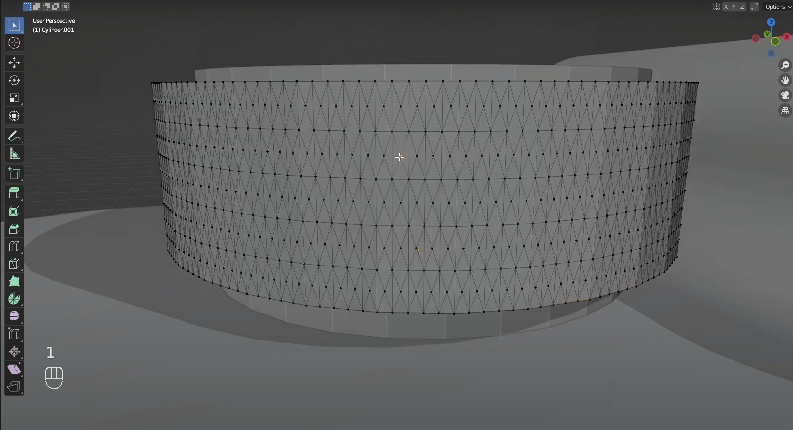
- Then I click one vertex and then press Shift+G to select all the vertex in this section and right click and select "Amount of connecting Edges"
- Now I simply press S to scale them outwards making the ridges we see on the knob.

- I duplicate this knob and scale it down to make the other smaller one.
- Using the same extrude E and inset face I, I make the other knob. Nothing different I guess.
- Then using the same technique I make the base structure of the lens. First using E to extrude outwards and then using same E to move backwards inside the lens giving the effect of the lens glass being inside and not on the surface.
Creating the Lens
- For the focus adjustment ridges on the lens, same technique as the pointy ridges on the knob. So Alt+Select, then P to seperate by selection, then subdivide to 4 cuts. Then the difference starts. We want straight ridges not pointy as before so now we press Shift+G and select length and change the threshold value to `0.0001`. Then with the edges selected we press Ctrl+B to bevel them slightly, dont overlap or go too far as they are the ridges so we want good distance between them. Finally press Alt+E and select "extrude face along normals" and the ridges can be popped up! Just grab to our liking.

- Then to create hollow parts in the camera like the top right flash section or the hole in the side metal thing, I used the boolean modifier.
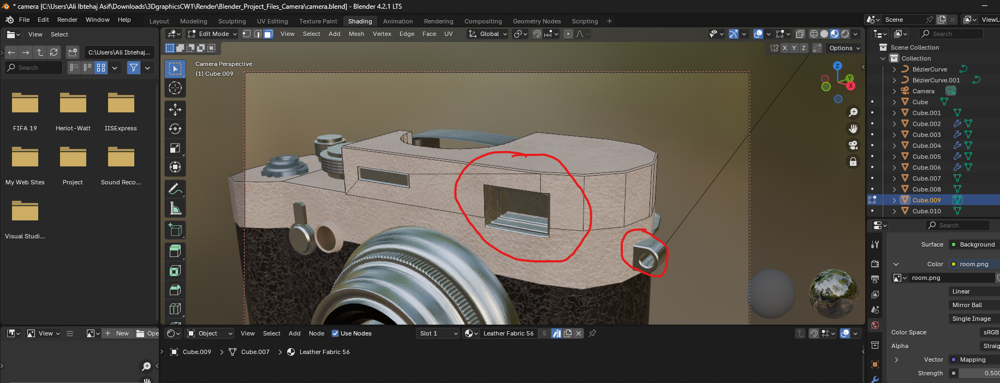
- Basically, I selected the base cube of the camera, added a boolean modifier and from the object selection eye dropper and selected the object I want to use to make the hole in the base cube. Then I click the object and to go object properties -> Viewport Display -> Display as: Bounds and get this:
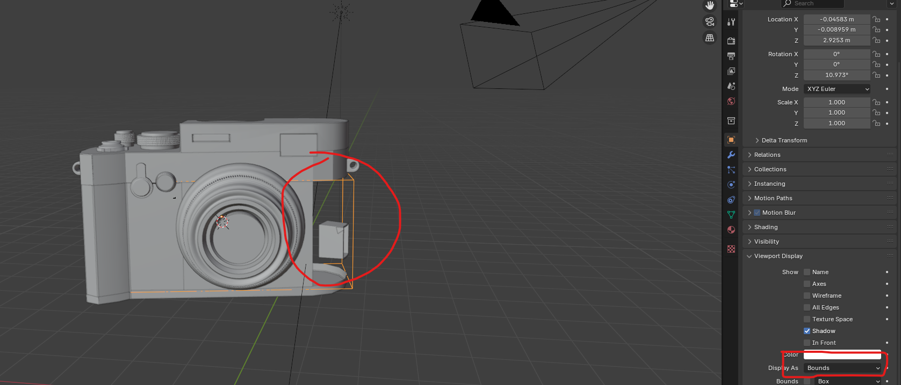
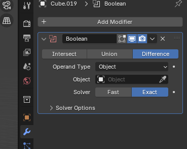
- Then when the hole seems good I apply the boolean modifier and delete the object.
- I used more or less these techniques to make the whole camera model. I also used a beizier curve at the top to make the tubes.
- Finally I used the Knife tool using K to cut my camera into different sections on which I would apply different materials.
## Materials

Blender has alot of free materials to choose, but just to try something different and to share links in this report, I installed the blenderkit plugin from here https://www.blenderkit.com and used their free materials.
- For the black leather I used this material: https://www.blenderkit.com/get-blenderkit/4b3c4573-226a-48bd-9fc7-597955579640/
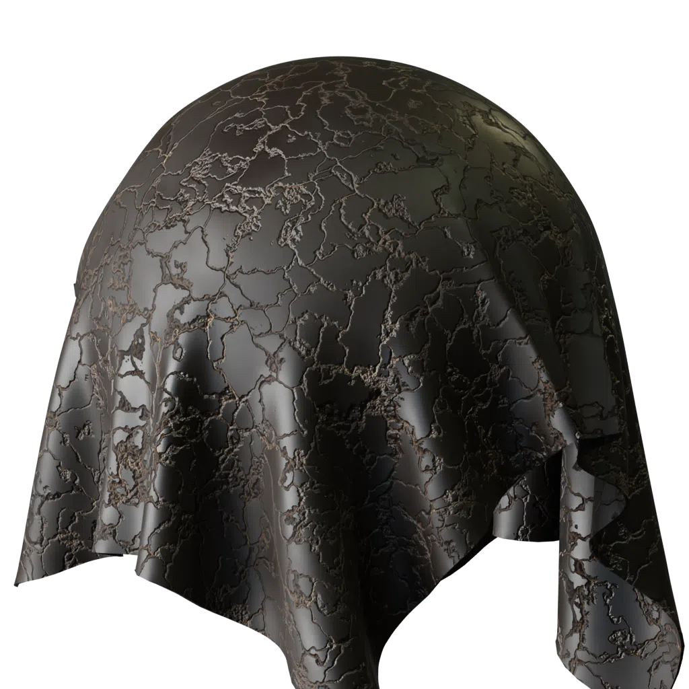
- For the white leather on top I used this: https://www.blenderkit.com/get-blenderkit/3e8c5299-b431-4067-852b-e87b21ac62a0/
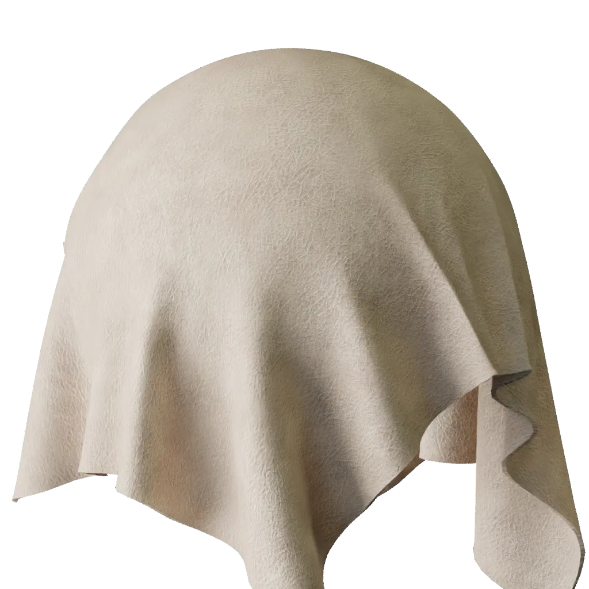
- For the metal parts I used https://www.blenderkit.com/get-blenderkit/e72d0a8d-0e2a-4adc-a2ed-f5b51d87b1cb/

- For the reflective glass for lens I used https://www.blenderkit.com/get-blenderkit/c4fd58d6-a60e-431a-a9a4-7f92a1412973 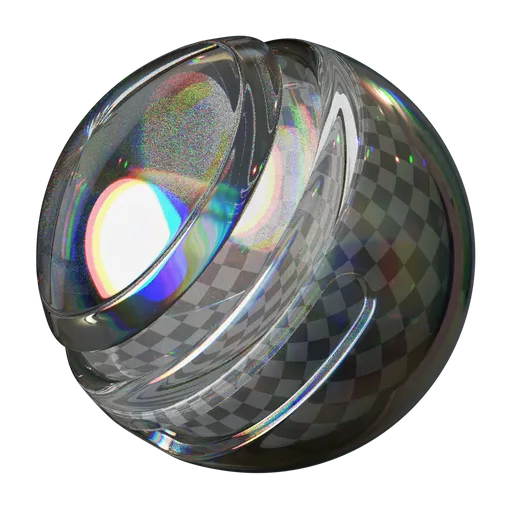

- I tried many many materials just for fun so there might be alot in the assets file.
- To apply the materials I go to the shading tab and apply them
- Obviously most of the time just applying is not all. We want to adjust how much zoomed in are we on the material we use to get the desired look. So for that I go to the "UV Editting" tab and select the edges or faces on which my material is applied and in the left section I press Ctrl+A to select it all and then press S to stretch it out or in according to the material I have and get the desired look.
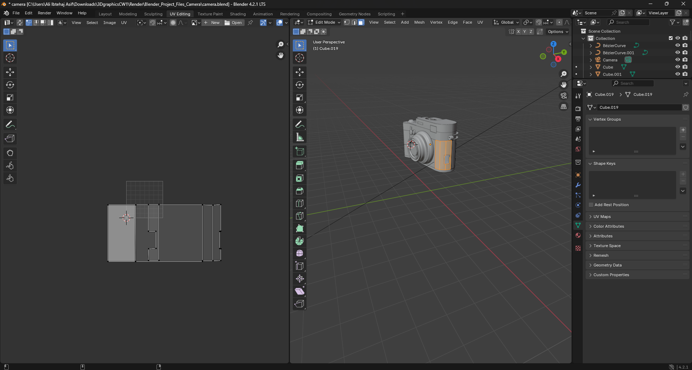

# 2. Headphones
## Reference
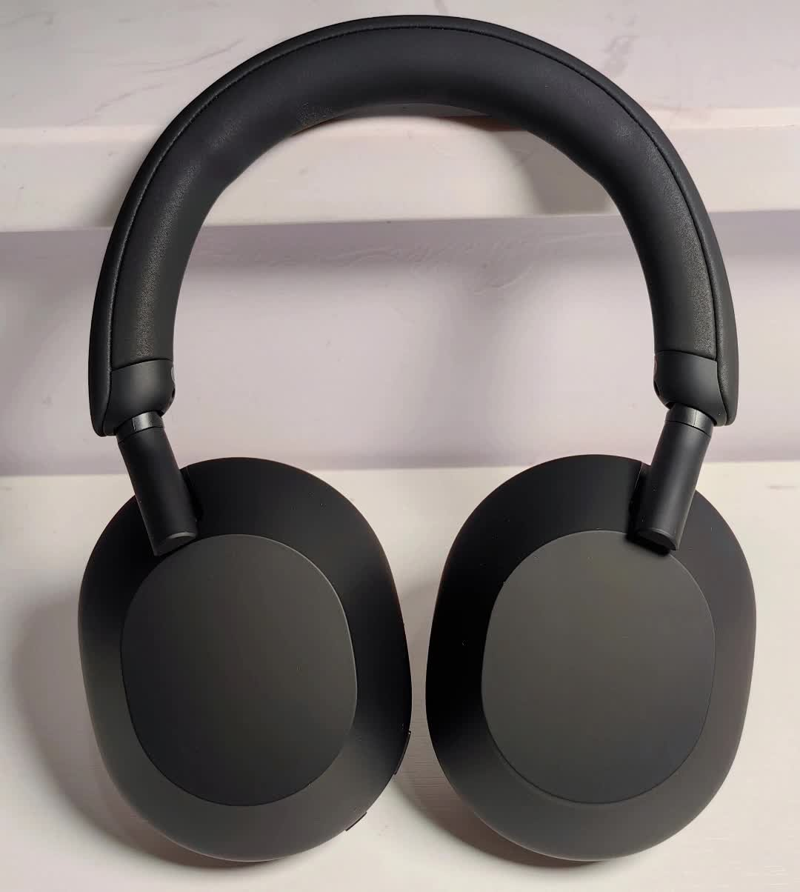
## Modelling
- For the basic shape I used circle and cubes and scaled them to give the required size.
- Then I used Ctrl+R and made several cuts in the cube.
- Then in the Mesh -> Transform -> bend option I bend them to the desired shape.
- For the head band I used more precise bending by adding a simple deform modifier, then adding axis to the object, changing the x-axis to 90 and then in the modifier setting it to bend and changing the angle.
- Most of the other techniques I have discussed before with the camera.
## Material
- For black I used: https://www.blenderkit.com/get-blenderkit/335d2f7f-b9f3-497d-ac3c-f01c67ff1478/
- For metal I used BMD_CarbonFiber_0023 from the blender material search

# 3. Laptop
## Reference
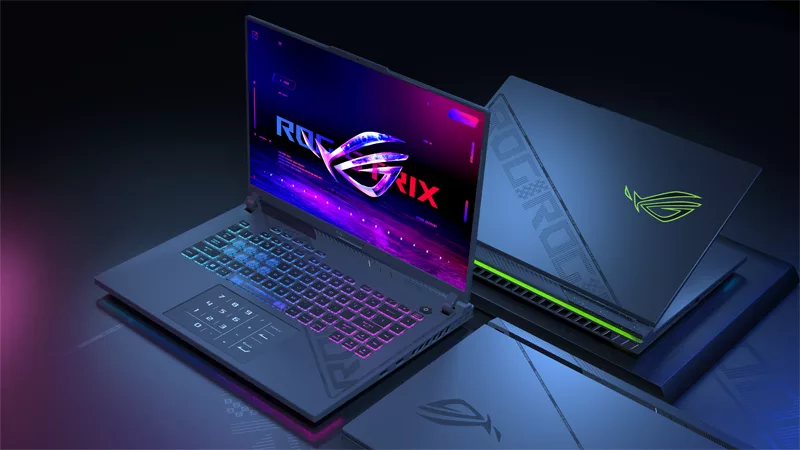
## Modelling
- For the basic shape I used cubes and scaled them to give the required size.
- curved the edges by first applyiong the bevel modifier. Then selecting the edges and press Ctrl+B to bevel then more and make smooth.
- Duplicated most of the keys. For the longer ones I selected their edge and pressed G to move/stretch it.
- For the red back lit I extruded the edge of the keys down, selected the extruded face only and changed color to red. For the keys letters I made a image with the keys and then applied it to a plane, same for the wallpaper and other images.
## Material
- For black I used: https://www.blenderkit.com/get-blenderkit/335d2f7f-b9f3-497d-ac3c-f01c67ff1478/

# 4. Table + Tea cup
## Reference
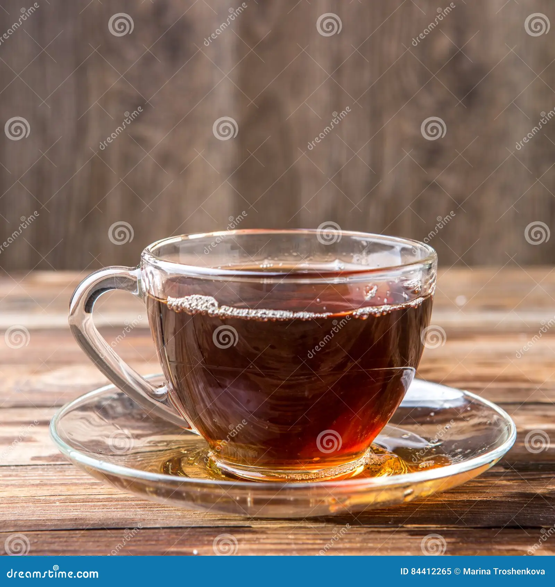
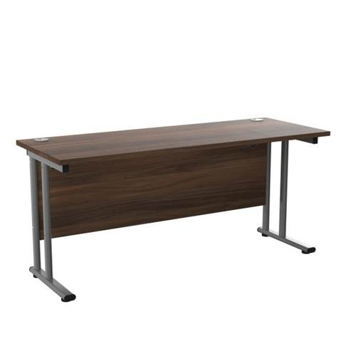
## Modelling
- For the table basic shape I used cubes and scaled them to give the required size, most of the table is just that apart from the base of legs where I divided it into subsections and curved it using bevel and auto smooth.
- For the cup I added a cylinder and selected its bottom edges and scaled them down. Then I added loop cut along the height of the cylinder and scaled them accordingly to make the shape of a cup.
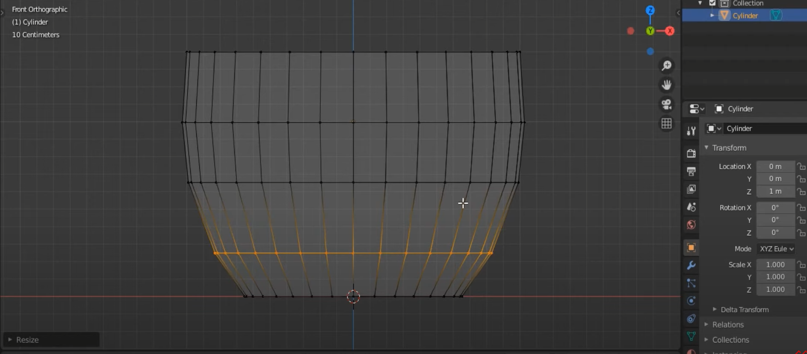
- To make the handle I selected a rectanle face between the subdivision on the cup and extrude it, and used spin tool to spin the extruded part to stretch it into a handle shape.
- Finally applied a clear glass material in shadding
## Material
- For glass I used: https://www.blenderkit.com/get-blenderkit/7ca71840-5c0e-4469-908b-df84aa24915f/
- For the table top I used weatherboard wood: https://www.blenderkit.com/get-blenderkit/165b903b-465d-4f32-ae81-29acd7ff156f/ 

# 5. Scene
## Reference
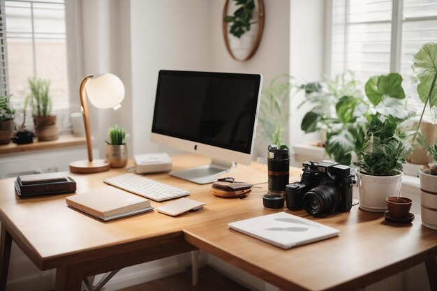
## Modelling
- For the scene I used 5 planes, 3 for the walls, 1 floor and one window
- I added 2 area light to the window one with a slight bend upwards and one with a bend downwards. This would mimic how light enters from a window (rectangle area) and scaters around. The downward light is the one hitting the table from the window which gives a realistic effect and good shadow.
- I placed all my objects in this scene: table with cup, camera, laptop and headphones on top.
## Material
- For walls I used: https://www.blenderkit.com/get-blenderkit/a831d519-327c-4ff0-8dc5-2bbd8910471c/
- For the window I used this image: 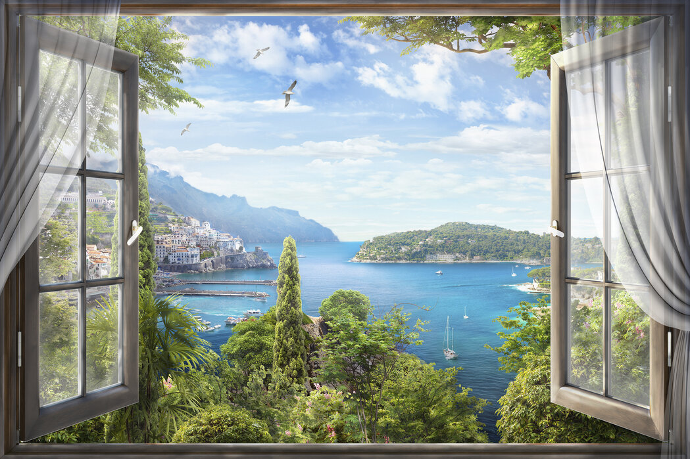
## Render Settings
- I used the `Cycles` Render engine as it is much better and realistic. I used the `GPU compute` device and in the system preferences selected the CUDA option with my GPU to generate good 3D renders fast.
- For the light I kept the basic settings as the results were good enough

# Output
For the final output I would show how each object looked in my scene
- Camera
- Headphone
- Laptop
- cup
- Table + complete room 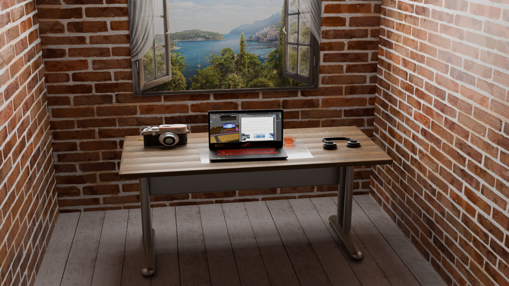

